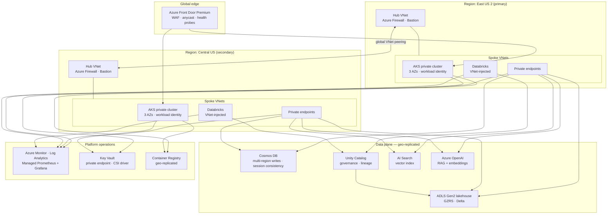

# Azure Data & AI Platform — Reference Blueprint

A complete, production-shaped platform for a **Data & AI SaaS application
serving 1,000,000 registered users**, expressed entirely as code: Terraform,
Kubernetes, Databricks, Python, and two independent CI/CD implementations.

> **This platform has never been deployed, and cannot be.**
> No pipeline in this repository holds cloud credentials, and no pipeline runs
> `terraform apply`. Every tenancy identifier is a placeholder. This is a
> blueprint built to be *read, reviewed, linted and scanned* — the way real
> platform teams design a system before the first dollar is spent.
> See **[docs/00-safety-and-placeholders.md](docs/00-safety-and-placeholders.md)**.

---

## The system

**Purple** is a fictional Data & AI SaaS: users ingest their own datasets, query
them through a conversational AI assistant, and consume scheduled analytics.
It is fictional so that the *platform* is the subject, but its requirements are
deliberately realistic.

| Requirement | Target |
|---|---|
| Registered users | 1,000,000 |
| Daily active users | ~120,000 |
| Peak API throughput | 2,000 req/s |
| Availability SLO (API) | **99.95%** — 21.9 min/month error budget |
| Availability SLO (AI assistant) | 99.9% — 43.8 min/month |
| Latency SLO (API p99) | < 400 ms |
| RPO / RTO (regional failure) | 0 / < 5 min — active-active |
| Data residency | US, dual-region |

The availability arithmetic behind those numbers — and why 99.95% is the honest
target rather than a marketing 99.99% — is worked through in
**[docs/architecture/02-availability-model.md](docs/architecture/02-availability-model.md)**.

---

## Architecture at a glance



Every arrow crossing into the data plane is a **private endpoint**. No PaaS
service in this design exposes a public endpoint; public network access is
disabled at the resource level, not merely firewalled.
Details: **[docs/architecture/03-network-topology.md](docs/architecture/03-network-topology.md)**.

---

## Repository map

| Path | What lives here |
|---|---|
| **[`docs/`](docs/)** | Architecture, decision records (ADRs), and operational runbooks |
| **[`infra/terraform/modules/`](infra/terraform/modules/)** | Reusable, versioned Terraform modules — one concern each |
| **[`infra/terraform/environments/`](infra/terraform/environments/)** | `dev` / `stage` / `prod` compositions of those modules |
| **[`infra/terraform/bootstrap/`](infra/terraform/bootstrap/)** | The chicken-and-egg problem: creating the remote state backend |
| **[`platform/kubernetes/`](platform/kubernetes/)** | Cluster baseline, Helm/Kustomize overlays, Gatekeeper policy |
| **[`platform/policies/`](platform/policies/)** | Azure Policy as code — guardrails that outlive any one deployment |
| **[`services/`](services/)** | The Python application: API, worker, Dockerfiles |
| **[`data/databricks/`](data/databricks/)** | Notebooks, job definitions, Unity Catalog model, medallion pipelines |
| **[`cicd/jenkins/`](cicd/jenkins/)** | Declarative Jenkinsfiles and a shared pipeline library |
| **[`.github/workflows/`](.github/workflows/)** | The checks that actually run on every push |
| **[`tools/`](tools/)** | Repository guards, including the placeholder-leak scanner |

---

## Where the interesting decisions are

If you are reviewing this repository, these are the files worth reading. Each
contains a decision that a competent engineer could reasonably have made
differently, with the reasoning recorded next to the code.

| File | The decision, and why it is not obvious |
|---|---|
| [`modules/cosmosdb/main.tf`](infra/terraform/modules/cosmosdb/main.tf) | Partitioning by `/userId` rather than `/tenantId`. Irreversible, and the intuitive choice creates a hot partition that no amount of throughput fixes. |
| [`services/api/purple_api/health.py`](services/api/purple_api/health.py) | Three probes doing three different jobs. Liveness checks **no** dependencies — putting them there turns a dependency outage into a cluster-wide restart storm. |
| [`base/api-deployment.yaml`](platform/kubernetes/base/api-deployment.yaml) | Memory limits but deliberately **no CPU limit**: CFS quota throttles a latency-sensitive service even on an idle node, producing exactly the p99 spikes the SLO measures. |
| [`modules/private-dns/main.tf`](infra/terraform/modules/private-dns/main.tf) | The failure mode that looks like a firewall problem and is a DNS problem. One zone, many links, is the only safe topology. |
| [`modules/identity/main.tf`](infra/terraform/modules/identity/main.tf) | Workload identity federation — how the platform ends up with **zero** application credentials rather than well-managed ones. |
| [`services/api/purple_api/rag.py`](services/api/purple_api/rag.py) | A one-line security boundary: the per-user filter whose absence is the defining data-leak pattern of enterprise RAG. |
| [`services/tests/test_rag_isolation.py`](services/tests/test_rag_isolation.py) | A regression test that fails if that filter is ever removed, including a check against the source itself. |
| [`modules/observability/alerts.tf`](infra/terraform/modules/observability/alerts.tf) | Multi-window multi-burn-rate SLO alerting, with the error-budget arithmetic worked through, instead of CPU-threshold noise. |
| [`environments/dev/main.tf`](infra/terraform/environments/dev/main.tf) | Every cost/fidelity trade against production, stated explicitly — including what dev consequently cannot catch. |

## Running the checks locally

Everything is driven through one entrypoint. No Azure account required.

```bash
make help        # list every target
make validate    # terraform fmt + validate across all modules and environments
make lint        # tflint, ruff, kube-linter
make security    # gitleaks, checkov, tfsec, trivy, placeholder guard
make test        # pytest for the Python services
make all         # everything above, in the order CI runs it
```

`make` degrades gracefully: any tool that is not installed is reported as
skipped rather than failing the run, so you can start with nothing installed
and add tools as you go. See [`docs/00-how-to-use-this-repo.md`](docs/00-how-to-use-this-repo.md).

---

## Design decisions

Significant choices are recorded as ADRs rather than buried in commit messages,
so the *reasoning* survives even when the code changes.

Start with [ADR index](docs/adr/README.md).

---

## Licence

[MIT](LICENSE). This is a teaching artifact — copy anything you find useful.
